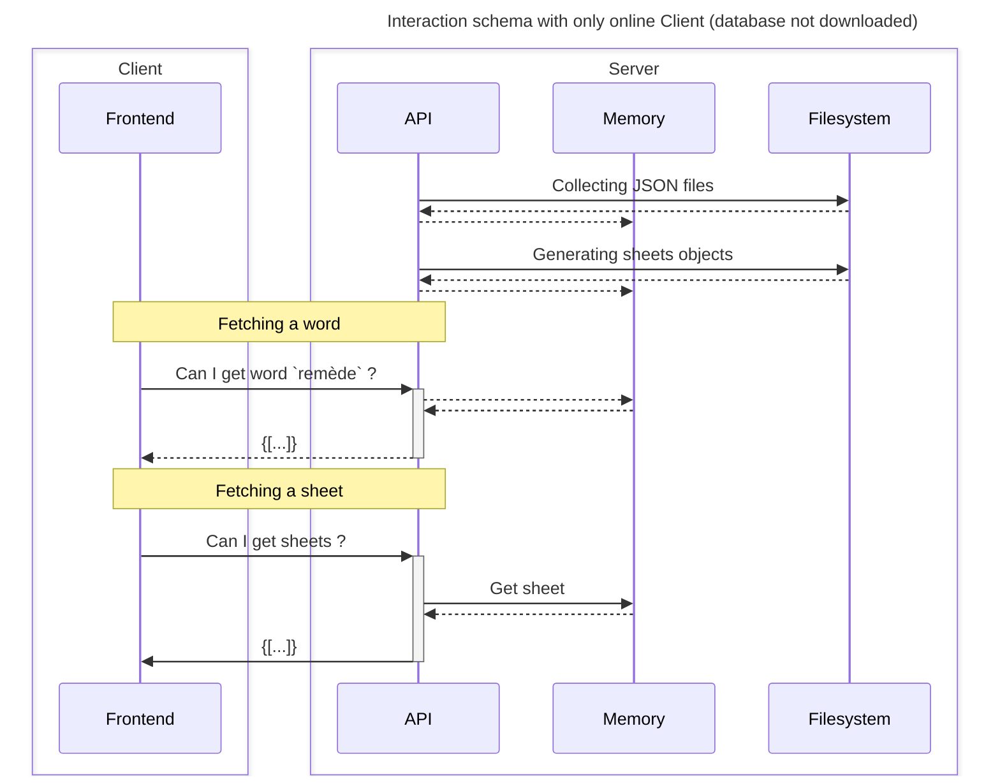
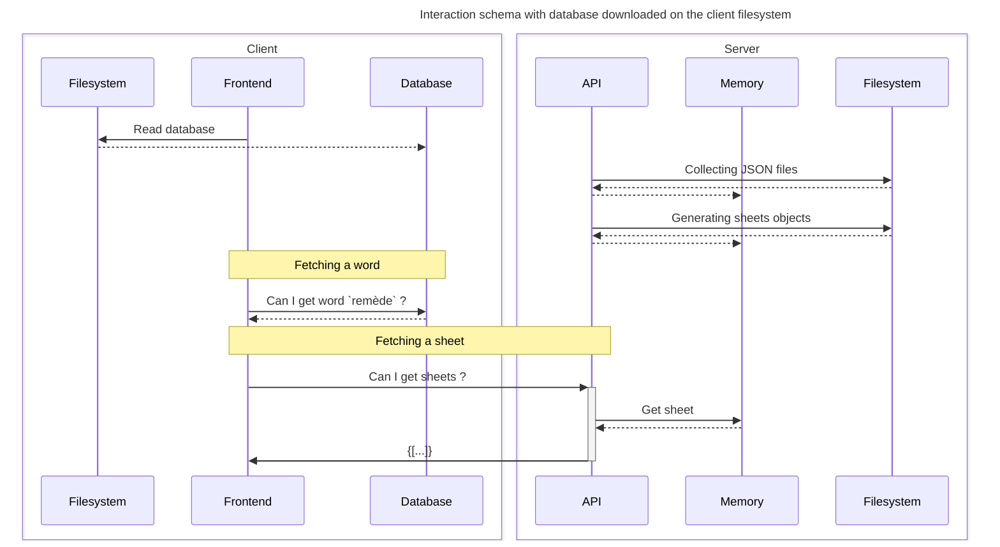

# Contributing
Welcome at Rèmede ! We are happy to welcome new contributors like you !

## How to contribute
**To contribute, you can:**
- Open an issue ([here](https://github.com/camarm-dev/remede/issues))
- Choose an issue, fork the repository, resolve it and open a pull request ! ([complete guide](#guide))
- Contact us to become part of our team (software@camarm.dev)
  - So you'll have access to this repository

## Guide

This project is devlopped using [Typescript](https://www.typescriptlang.org/), [Python](https://python.org) and [VueJS](https://vuejs.org/). You need at least to know one of these to start contributing !

### Understanding project structure

#### Using only the API

#### With database downloaded

### Big steps
1. Open or choose an issue on our [issue page](https://github.com/camarm-dev/remede/issues)
2. Fork and clone the repository on your computer
3. Read [the documentation](https://remede.camarm.fr/EN), and contact us for more informations (at software@camarm.dev).
4. Make your changes, and separate your work in multiple commits
5. Open a pull request
6. Wait and make requested changes
7. You're now a contributor ! Thank you very much !

## Documentation
You can find the documentation [here](/docs/EN.md) or on [our website](https://remede.camarm.fr/EN).

