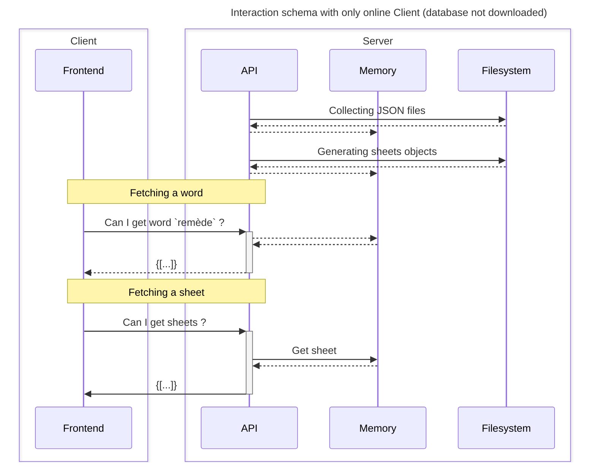
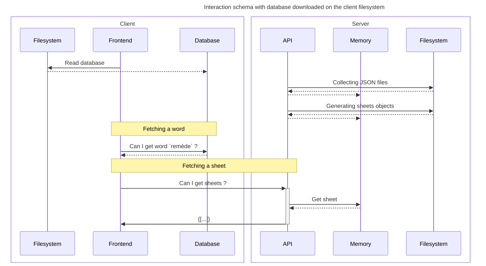

# Contributing
Welcome at Rèmede ! We are happy to welcome new contributors like you !

## Table of content
- [How to contribute](#how-to-contribute)
- [Big steps](#big-steps)
- [Guide](#guide)
  - [Project structure](#understanding-project-structure)
  - [Lifecycle Schemas](#lifecycle-schemas)
  - [Add a custom word](#add-a-custom-word)
- [Documentation](#documentation)

## How to contribute
**To contribute, you can:**
- Open an issue ([here](https://github.com/camarm-dev/remede/issues))
- Choose an issue, fork the repository, resolve it and open a pull request ! ([complete guide](#guide))
- Contact us to become part of our team (software@camarm.dev)
  - So you'll have access to this repository

### Big steps
1. Open or choose an issue on our [issue page](https://github.com/camarm-dev/remede/issues)
2. Fork and clone the repository on your computer
3. Read [the documentation](https://remede.camarm.fr/EN), and contact us for more informations (at software@camarm.dev).
4. Make your changes, and separate your work in multiple commits
5. Open a pull request
6. Wait and make requested changes
7. You're now a contributor ! Thank you very much !

## Guide

This project is developed using [Typescript](https://www.typescriptlang.org/), [Python](https://python.org) and [VueJS](https://vuejs.org/). You need to know these to start contributing !

### Understanding project structure

First, the folders;
- `server.py`: Main API, made with Fastapi
- `data`: Ressources to make Remède database and Remède databases
- `app`: Ionic project
  - `src`: Vuejs project
  - `electron`: Electron project, generated by [`@capacitor-community/electron`](https://github.com/capacitor-community/electron)
  - `android`: Android project, generated by [`@capacitor/android`](https://capacitorjs.com/docs/android)
- `api-definition`: API to fetch Wictionary definitions (it's a git submodule)
- `scripts`: Scripts to parse, generate and make migrations on the database.
- `corrector`: Docker to run languagetool API
- `tts`: Docker compose to run nanotts with opentts
- `builds`: All builds for all platforms by version

### Lifecycle Schemas

_These schemas are outdated and not really readable. Visit [`INFRASTRUCTURE.md`](INFRASTRUCTURE.md) for more._

In this section you will understand Remède Lifecycle with different schemas. 

**Client -> Server without dictionary downloaded**

**Client -> Server with dictionary downloaded**

### Add a custom word

Remède fetches words from the Wictionary but sometimes, words are not in our list so, you can add custom words...

1. Add it to `data/IPA.txt`
   1.  In alphabetic order, add your word with the following schema `word\t/phonetic/` (`\t` represents a <kbd>TAB</kbd> char, not spaces)
2. Add it to `data/custom_words.json`, if necessary
   1. Check on the [french Wictionary](https://fr.wiktionary.org) if your word exist.
   2. If it does not exist, fill his document manually in the `data/custom_words.json`. Don't forget to quote your sources in the `credits` field.
3. Before making a PR, rebuild ressources (so your word will be added next time database is built)
   1. Run `python3 scripts/pre_generate_ressources.py`, if it outputs an error, check the previous steps...

Check also [`PARSING.md` - Add a word](/PARSING.md#ajouter-un-mot-rapidement)

### Parsing

A complete Guide about parsing and database generation is written in french at [`PARSING.md`](https://github.com/camarm-dev/remede/blob/main/PARSING.md)

## Documentation
You can find the documentation [here](/docs/EN.md) or on [our website](https://remede.camarm.fr/EN).

