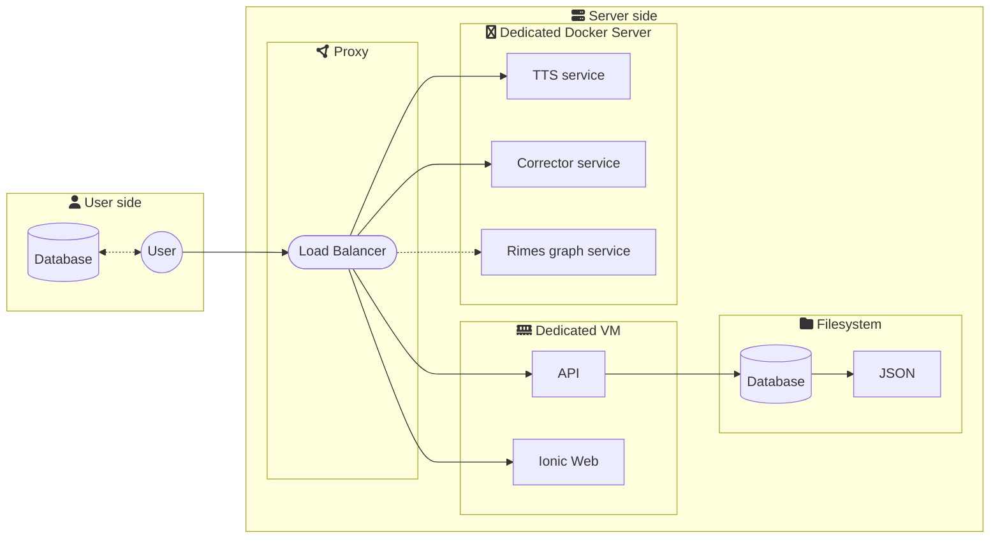

# Infrastructure

This file is updated when the infrastructure changes. It shows a schema of the current infrastructure.

## Image on mermaid.live

[](https://mermaid.live/edit#pako:eNqFk-9ugjAUxV-l6SdMZA9AliUquml0M-K2ZIXE0l5mI1BTYJEY330X2PwTcbsfoLn9cc_Jod1ToSVQh34avl2T6cJPCVZWhE3Dp6uIOxG3iwwMea0emZKw8mkDVjVhlstzHvIMOgG5t-_sB9KzrArudBoMUnlrMFJfONVrXlfDjx80tFBGxGCnaDojc6N35Qmt6qhLbHTRt9hUc0n6POapABN0TvTRUotKAok2JXFBKsFzkORtdinTr8cPWG8-Dtp2XDbWqRLkHcLgP0mpxQYMOwYS6t2Zslvv_sSDybTKPbLl0iNVkkpAK_HEBtoYELk2t7nqx03ZQiWYbePtGv0rtkjHEr2OVAxZmeWQXCoMaifD89NyCQxrYMQm3stzmyQuaJcmYBKuJJ7ZfdX2ab6GBHzq4FJys6lOzwE5XuTaK1NBndwU0KXFVmKiruJoOfltYs4Yyay5A_VV6NItTz-0RiTicQaHb8ro6jI)