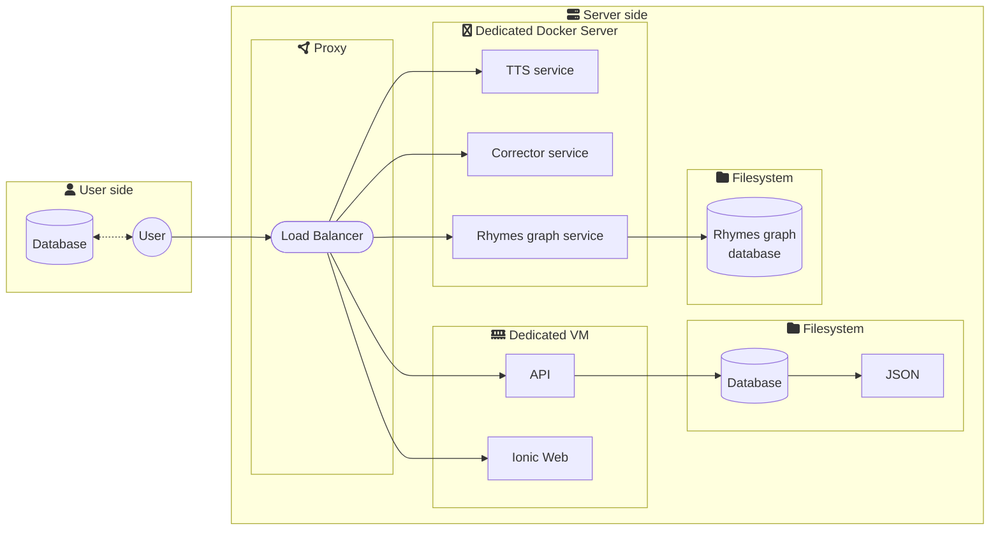
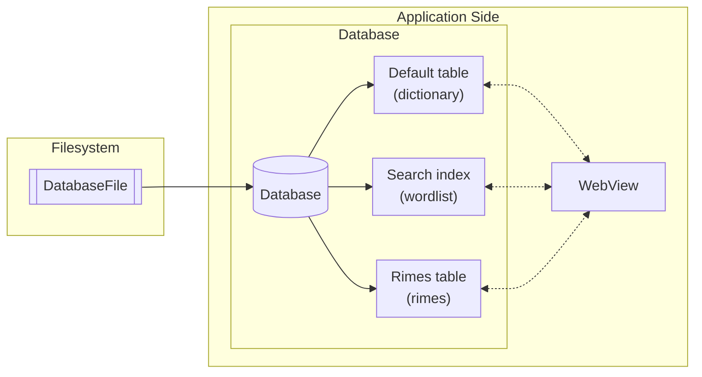

# Infrastructure

This file is updated when the infrastructure changes. It shows a schema of the current infrastructure.

**Global infrastructure schema**

```mermaid
graph LR
    subgraph "`fa:fa-user User side`"
        J[(Database)] <-.-> A((User))
    end
    subgraph "`fa:fa-server Server side`"
        subgraph fa:fa-circle-nodes Proxy
            A((User)) --> B([Load Balancer])
        end
        subgraph fa:fa-memory Dedicated VM
            B --> C[API]
            B --> D[Ionic Web]
        end
        subgraph docker["`fa:fa-docker Dedicated Docker Server`"]
            B --> G[TTS service]
            B --> H[Corrector service]
            B --> L[Rhymes graph service]
        end
        subgraph fa:fa-folder Filesystem
            C --> E[(Database)]
            E --> F[JSON]
        end
        subgraph fa:fa-folder Filesystem
            L --> O[(Rhymes graph\ndatabase)]
        end
    end
```

**Local database schema**

```mermaid
graph LR
    subgraph "Application Side"
        subgraph "Database"
            DB[(Database)] --> Index
            DB --> Main
            DB --> Rimes
            subgraph Index["Search index\n(wordlist)"]

            end
            subgraph Main["Default table\n(dictionary)"]

            end
            subgraph Rimes["Rimes table\n(rimes)"]

            end
        end
        Main <-.-> A[WebView]
        Index <-.-> A[WebView]
        Rimes <-.-> A[WebView]
    end
    subgraph "Filesystem" 
        DFB[[DatabaseFile]] --> DB
    end
```
