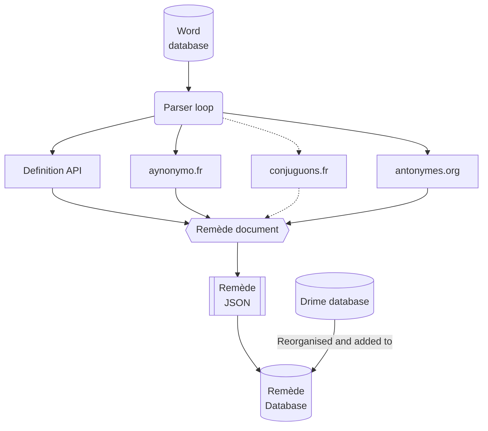

## Générer les données Remède

Générer les données Remède consiste à générer **les fichiers JSON**, pour chaque lettre (`data/REMEDE_a.json`) mais aussi **la base Sqlite** `data/remede.db`.

> [!NOTE]
> La base `data/remede-less.db` est une ancienne version, qui ne contient pas les champs `exemples`, `etymologies` et `rimes`. Elle est utilisée comme base **light**, pour les appareils avec peu de place.

**Organisation d'une génération de données:**
0. `pre_generate_ressources.py` génère les ressources nécessaires (`mots.txt` et `ipa.json`, depuis `IPA.txt`)
1. `parse.py` génère un fichier JSON par lettre (plusieurs heures)
2. `generate_sqlite.py` génère la base Sqlite, depuis les fichiers JSON (plusieurs dizaines de minutes)
3. `generate_index.py` génère un index de recherche
4. `build_rimes.py` ajoute les rimes au dictionnaire

> [!IMPORTANT]
> Tous les programmes contenus dans le dossier `scripts` doivent être executés **à la racine du project** (eg. `python3 scripts/parse.py`)

## Parse.py

**Comment ça fonctionne ?**
1. Il itère + 250 000 mots (depuis `data/mots.txt`)
2. Pour chaque mot, il trouve sa définition avec [`api-definition`](#api-définition) et des services tiers
3. Il génère le document Remède
4. Il enregistre sous format `JSON`
5. La base de données "Drimes" est réorganisée et ajoutée à la base Remède.



### Lancer le parsing

1. Lancer [api-definition](#api-définition) en local
2. Lancer `parse.py`
```shell
python3 scripts/parse.py
```
Cette opération prend plusieurs jours !

> [!NOTE]
> Vous pouvez sélectionner certaines lettres à parser avec un argument : `python3 scripts/parse.py --letters a,b,c,d,e` 

## Api Définition

Cette API, originellement écrite par [Frederic Gainza](https://api-definition.fgainza.fr/), scrap les données du [Wictionary français](https://fr.wiktionary.org/wiki/Wiktionnaire:Page_d%E2%80%99accueil).

Pour ce projet, **une réadaptation a été effectuée** par [Labse Studio](https://github.com/LabseStudio/api-definition)

### Lancer avec docker

Le code de cette API est contenu dans `api-definition` (c'est un submodule git).

Dans `api-definition`
```shell
docker build -t remede-definition-api . && docker run -p 8089:80 remede-definition-api
```

## Ajouter un mot rapidement

Le script `scripts/add_word.py` permet d'ajouter un mot rapidement à la base sans la reconstruire...

Il :
- Ajoute votre mot dans `data/mots.txt`
- Ajoute votre mot dans le JSON
- Ajoute votre mot dans `data/remede.db`
- Re-génère l'index de `data/remede.db`

```shell
python3 scripts/add_word.py <word> <phoneme>
```

Pour ajouter plusieurs mots:

`wordlist.txt` (tabulation entre mot et ipa: `mot\t/ipa/`)
```
acupuncture /a.ky.pɔ̃k.tyʁ/
remède  /ʁəmɛd/
```
et exécuter
```shell
python3 scripts/add_word.py -f wordlist.txt
```
