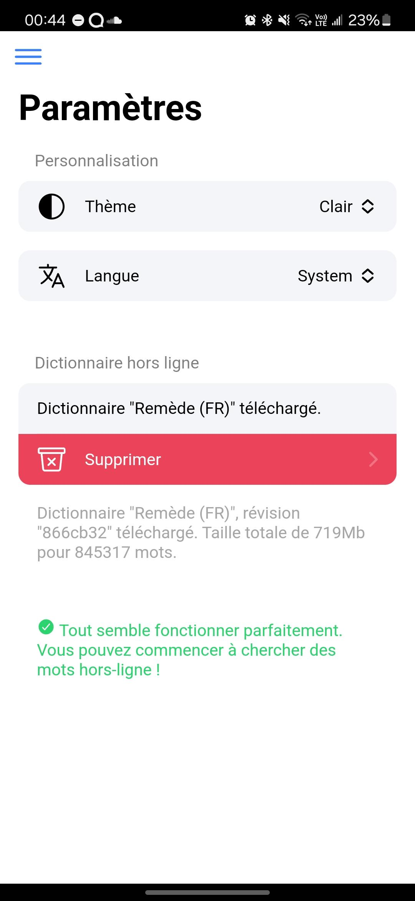
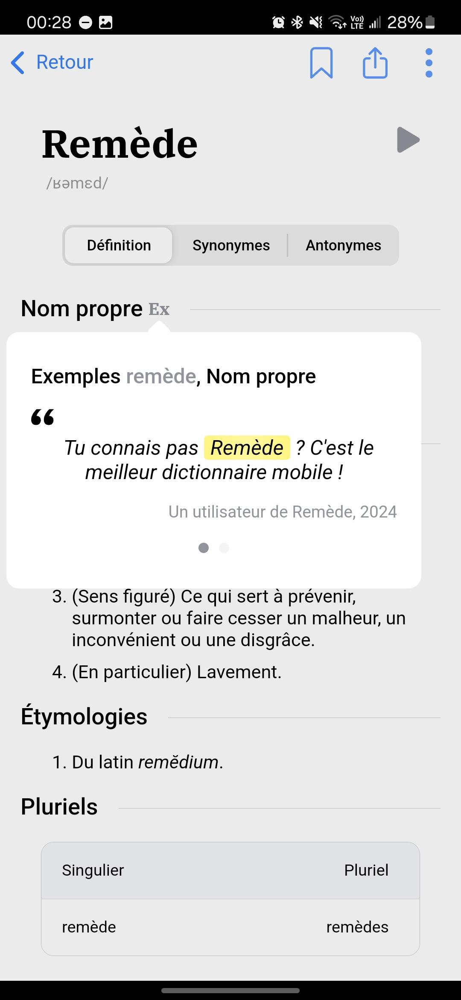

 
 

# Remède
Open Source and free alternative to Antidote dictionary.

[<kbd>Open application</kbd>](https://remede-app.camarm.fr)

[Data credits](https://docs.remede.camarm.fr/docs/database/credits) • [License](https://github.com/camarm-dev/remede/blob/main/LICENSE) • [Website](https://remede.camarm.fr) • **[Download](https://remede.camarm.fr/download)** • **[API](https://api-remede.camarm.fr/docs)**

[](https://apps.obtainium.imranr.dev/redirect?r=obtainium://app/%7B%22id%22%3A%22dev.camarm.remede%22%2C%22url%22%3A%22https%3A%2F%2Fgithub.com%2Fcamarm-dev%2Fremede%22%2C%22author%22%3A%22camarm-dev%22%2C%22name%22%3A%22Rem%C3%A8de%22%2C%22preferredApkIndex%22%3A0%2C%22additionalSettings%22%3A%22%7B%5C%22includePrereleases%5C%22%3Afalse%2C%5C%22fallbackToOlderReleases%5C%22%3Atrue%2C%5C%22filterReleaseTitlesByRegEx%5C%22%3A%5C%22%5C%22%2C%5C%22filterReleaseNotesByRegEx%5C%22%3A%5C%22%5C%22%2C%5C%22verifyLatestTag%5C%22%3Afalse%2C%5C%22dontSortReleasesList%5C%22%3Afalse%2C%5C%22useLatestAssetDateAsReleaseDate%5C%22%3Afalse%2C%5C%22releaseTitleAsVersion%5C%22%3Afalse%2C%5C%22trackOnly%5C%22%3Afalse%2C%5C%22versionExtractionRegEx%5C%22%3A%5C%22%5C%22%2C%5C%22matchGroupToUse%5C%22%3A%5C%22%5C%22%2C%5C%22versionDetection%5C%22%3Atrue%2C%5C%22releaseDateAsVersion%5C%22%3Afalse%2C%5C%22useVersionCodeAsOSVersion%5C%22%3Afalse%2C%5C%22apkFilterRegEx%5C%22%3A%5C%22%5C%22%2C%5C%22invertAPKFilter%5C%22%3Afalse%2C%5C%22autoApkFilterByArch%5C%22%3Atrue%2C%5C%22appName%5C%22%3A%5C%22%5C%22%2C%5C%22shizukuPretendToBeGooglePlay%5C%22%3Afalse%2C%5C%22allowInsecure%5C%22%3Afalse%2C%5C%22exemptFromBackgroundUpdates%5C%22%3Afalse%2C%5C%22skipUpdateNotifications%5C%22%3Afalse%2C%5C%22about%5C%22%3A%5C%22%5C%22%2C%5C%22refreshBeforeDownload%5C%22%3Afalse%7D%22%2C%22overrideSource%22%3A%22GitHub%22%7D
)

## Breaking changes with Remède 1.4.0

Remède 1.4.0 is released and old version of Remède are not supported anymore ! You can continue to search on Remède if you have downloaded the dictionary, but you must update your Remède application !

## Why Remède ?

Remède is a dictionary, which can replace any proprietary dictionary, with these advantages:
- Ready for all situations: rimes, examples, plurals, synonyms, antonyms, conjugation, even a corrector !
- Simple and nice interface
- Free
- Cross-platform
- Self-hostable
- Open source
- Off-line

## Table of content
- [Télécharger](#télécharger)
- [Générer la base](#générer-les-bases-de-données)
- [Documentation](#documentation)
- [Screenshots](#screenshots)

## Current: 1.4.0-beta — Phenomenal Feather

La version `1.4.0`, nom de code `Phenomenal Feather` inclue les nouvelles fonctionnalités suivantes :
- [x] Application traduite en anglais
- [x] Nouvelle structure de données
- [x] Applications de bureau
- [x] **Base révisée** avec +800 000 mots !
- [x] Support avancé des phonemes
- [x] Support avancé des rimes
- [x] Pluriels des mots
- [ ] Téléchargeable sur le **Play Store** !

## Télécharger

Téléchargez les exécutables pour votre plateforme depuis [la page releases](/releases)

Voir les autres méthodes de téléchargement sur [notre site](https://remede.camarm.fr).

[<kbd>Play Store</kbd>]()
SOON: Disponible sur Play Store

## Générer les bases de données

- Guide: [`PARSING.md`](https://github.com/camarm-dev/remede/blob/main/PARSING.md)
- Références: [documentation en ligne](https://remede.camarm.fr/FR#donn%C3%A9es)

## Documentation

La documentation est disponible sur [docs.remede.camarm.fr](https://docs.remede.camarm.fr)
- Guide de contribution: [`CONTRIBUTING.md`](https://github.com/camarm-dev/remede/blob/main/CONTRIBUTING.md)

## Screenshots

| Home page                                                | Word page                                                   |
|----------------------------------------------------------|-------------------------------------------------------------|
|                            |      |
| Rimes                                                    | Settings page                                               |
|  |  |
| Examples                                                 | Corrector                                                   |
|    |      |
  
