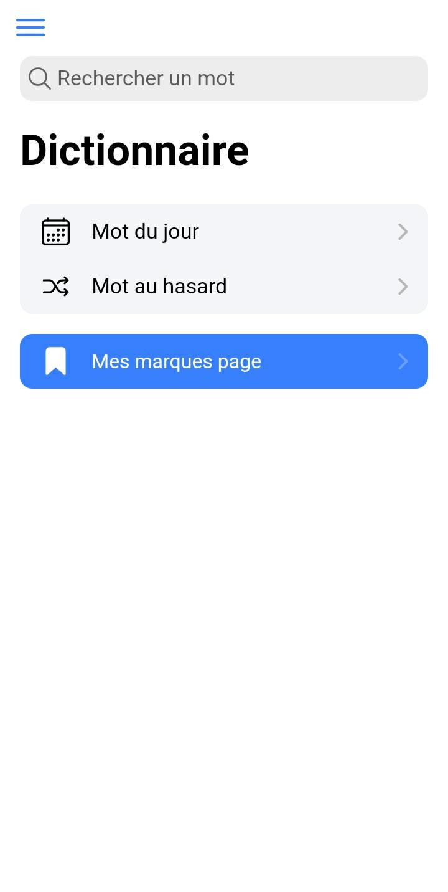
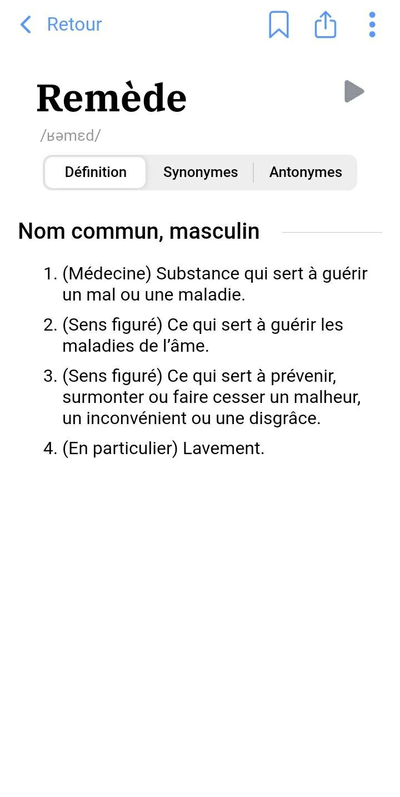
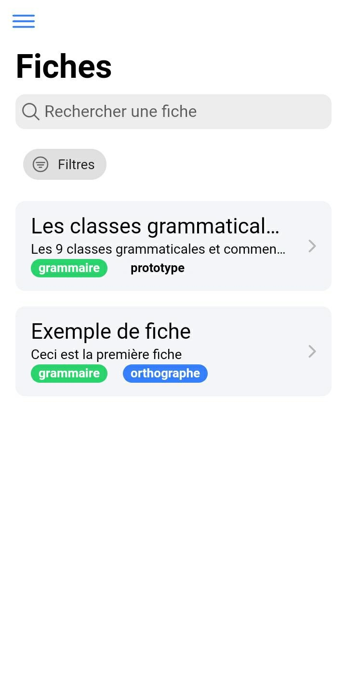

 
 

# Remède
Open Source and free alternative to Antidote dictionary.

[<kbd>Open application</kbd>](https://remede-app.camarm.fr)

[Data credits](https://remede.camarm.fr/FR#données-remède) • [License](https://github.com/camarm-dev/remede/blob/main/LICENSE) • [Website](https://remede.camarm.fr) • **[Download](https://remede.camarm.fr/download)** • **[API](https://api-remede.camarm.fr/docs)**

## Why Remède ?

Remède is a dictionary, which can replace any proprietary dictionary, with these advantages:
- Simple UI
- Nice UX
- Free
- Cross-platform
- Self-hostable
- Open source
- Off-line

## Table of content
- [Next](#next-110)
- [Télécharger](#télécharger)
- [Générer la base](#générer-les-bases-de-données)
- [Documentation](#documentation)
- [Screenshots](#screenshots)

## Current: 1.1.2 — Goofy Jellyfish, revision 2

La version `1.1.2`, nom de code `Goofy Jellyfish` inclue les nouvelles fonctionnalités suivantes :
- [x] **Examples** sur les définitions
- [x] **Nouvelle interface** sur la page de définitions
- [x] Possibilité de télécharger une base de donnée **light**.
- [x] Applications **Linux et Windows** (expérimentales)
- [x] Service de **prononciation** open source et auto-hébergé !
- [x] **Nouvelle base** (base de données révisée)
- [x] **Service de correction** open source et autohébergé !
- [x] Recherche **simplifiée** et plus **agréable**.
- [x] Serveur plus **stable**.
- [x] Navigation **sans limite** dans les définitions !
- [ ] Rhymes dictionary (arrive en `1.2.0`)

## Télécharger

Téléchargez les exécutables pour votre plateforme depuis [la page releases](/releases)

Voir les autres méthodes de téléchargement sur [notre site](https://remede.camarm.fr).

[<kbd>Play Store</kbd>]()
SOON: Disponible sur Play Store

## Générer les bases de données

- Guide: [`PARSING.md`](https://github.com/camarm-dev/remede/blob/main/PARSING.md)
- Références: [documentation en ligne](https://remede.camarm.fr/FR#donn%C3%A9es)

## Documentation

La documentation est disponible sur [remede.camarm.fr](https://remede.camarm.fr)
- Guide de contribution: [`CONTRIBUTING.md`](https://github.com/camarm-dev/remede/blob/main/CONTRIBUTING.md)

## Screenshots

| Home page                           | Word page                               |
|-------------------------------------|-----------------------------------------|
|       |          |
| Sheets page                         | Settings page                           |
|  |  |
  
